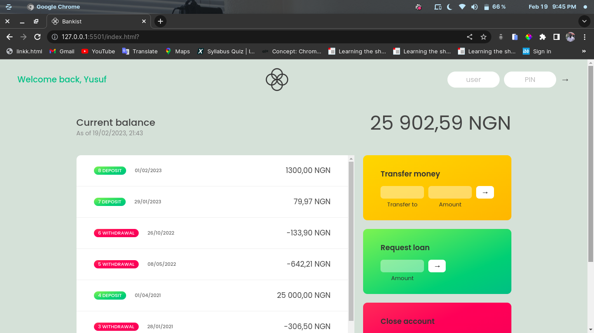
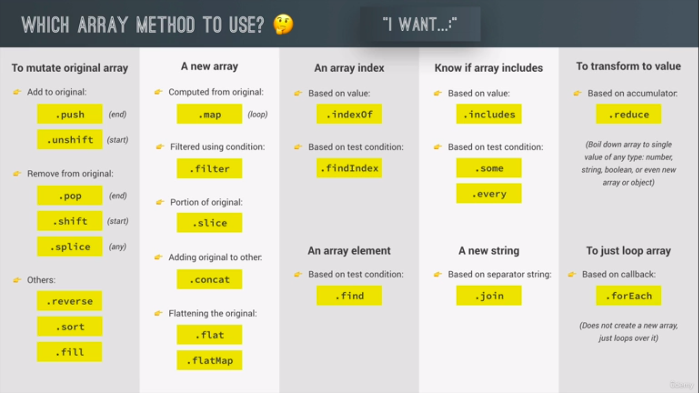

# Bankist-App

This project was designed as part of The Complete JavaScript Course 2023. I learned the concept of JavaScript, CSS, and HTML from the tutorial and I built this project along with the tutorial.

# Flowchart for the project

# Screenshot

# Credit

This project was created under the guidance of [Jonas Schmedtmann](https://www.twitter.com./jonasschmedtman) as part of the **The Complete JavaScript Course 2023** at [Udemy](https://www.udemy.com). I would like to express my gratitude to **Jonas Schmedtmann** for his course throughout the development of this project.

# What I learned
I learned the following JavaScript concept throughout this project.

- Array methods
- JavaScript Strings
- DOM manipulation
- Math methods
- BigInt
- Operations with date
- Internationalizing dates
- Timer

Contact
If you have any questions or comments about this project, please contact [Jonas Schmedtmann](https://www.twitter.com./jonasschmedtman)